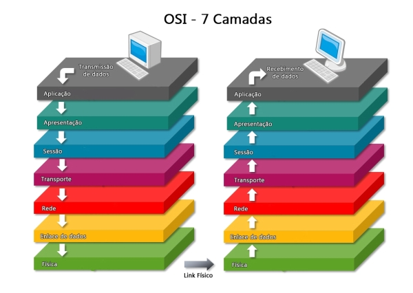
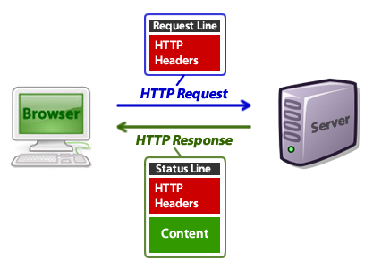
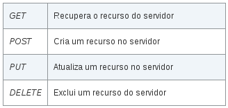
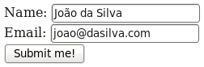

## O protocolo HTTP

O funcionamento do PHP depende do Apache e o apache depende do protocolo HTTP.

O protocolo HTTP é a roda que faz girar toda a internet, ele está na camada mais alta do modelo OSI (não confuda OSI com ISO).

O que é camada de rede? Espere aí, estamos fugindo do escopo deste artigo, mas é um assunto básico (para quem está 
estudando redes de computadores), então fica a imagem só para estigá-lo(a).



O HTTP trabalha com requisições (request) e respotas (response).

Você conhece um software que faz requisições HTTP?

Conhece sim! Esse navegador que está utilizando para ver está página é a resposta.

A imagem abaixo ilustra o processo.




> Se você digita um endereço na barra de endereço seu navegador e aperta a tecla Enter o navegador faz uma requisição 
> HTTP para o servidor do endereço digitado e o método dessa requisição é o GET.
> 
> Se você clicar em um link em um site, o navegador também se encarrega de fazer um requisição HTTP com o método GET, 
> para buscar o conteúdo da página que você clicou.
> 
> <small>Fonte: http://www.comocriarsites.com/html/como-funciona-os-metodos-get-e-post-diferencas/</small>

A imagem abaixo  ilustra o esquema com mais detalhes.


Existem outros métodos além do GET e POST, veja o quadro abaixo.



Eles servirão quando o assunto for sobre REST, por enquanto ficaremos apenas com GET e POST.


## Requisição

A requisição compreende três elementos:


- Uma linha de pedido:

    ```
    POST /www.devfuria.com.br/script-para-onde-envio-os-dados.php HTTP/1.1
    ```

- Os campos de cabeçalho do pedido

    ```
    Host: localhost

    User-Agent: Mozilla/5.0 (X11; Linux x86_64; rv:24.0) Gecko/20100101 Firefox/24.0
    ... eu apaguei as demais linhas
    ```

- O corpo do pedido

    ```
    email=joao@dasilva.com
    username=João da Silva
    ```

A requisição acima foi gerada pelo formulário web ilustrado abaixo



Repare que os campos viraram um par `nome=valor` no corpo do pedido.

Essa "mágica" eu mostro na próxima matéria.


## Resposta

A resposta também compreende três elementos:

- Uma linha de estatuto:

    ```        
    HTTP/1.1 200 OK
    ```

- Os campos de rúbrica da resposta

    ```
    Date: Fri, 31 Jan 2014 14:03:55 GMT
    Server: Apache/2.2.15 (CentOS
    ... eu apaguei as demais linhas
    ```

- O corpo da resposta

    ```
    Aqui é documento (normalmente HTML) de resposta
    ```

Repare na "linha de estatuto" que temos o código de resposta `200` e sua descrição `OK`.

Abaixo temos as 4 respostas, de longe, mais encontradas.

<div class="bs-example">
    <table class="table  table-striped">
        <tr>
            <th class="text-center">Código</th>
            <th class="text-center">Mensagem</th>
            <th class="text-center">Descrição</th>
        </tr>
        <tr>
            <td>200</td>
            <td>OK</td>
            <td class="text-left">O pedido foi realizado corretamente</td>
        </tr>
        <tr>
            <td>301</td>
            <td>MOVED</td>
            <td class="text-left">Os dados pedidos foram transferidos para um novo endereço</td>
        </tr>
        <tr>
            <td>404</td>
            <td>NOT FOUND</td>
            <td class="text-left">Clássico! O servidor não encontrou nada no endereço indicado. Partiram sem deixar endereço…:)</td>
        </tr>
        <tr>
            <td>500</td>
            <td>INTERNAL ERROR</td>
            <td class="text-left">O servidor encontrou uma condição inesperada que o impediu de satisfazer o pedido (às vezes acontecem coisas aos servidores…)</td>
        </tr>
    </table>
</div>

As descrições foram retiradas deste [artigo](http://pt.kioskea.net/contents/266-o-protocolo-http).


## GET

O método pode ser gerado por um formulário web e também por um link em sua página HTML. Ele de limite de capacidade e a 
URL só aceita (obviamente) strings, se você precisar passar arquivos deverá utilizar o POST.

> O método GET utiliza a própria URI (normalmente chamada de URL) para enviar dados ao servidor,
> quando enviamos um formulário pelo método GET, o navegador pega as informações do formulário
> e coloca junto com a URI de onde o formulário vai ser enviado e envia, separando o endereço
> da URI dos dados do formulário por um “?” (ponto de interrogação).
> 
> <small>Fonte: http://www.comocriarsites.com/html/como-funciona-os-metodos-get-e-post-diferencas/</small>

Ao final da URL colocamos o sinal `?` e utilizamos a combinação `nome=valor` separados pelo sinal `&`.

Também podemos utilizar o formulário web com a propriedade `metho` "setada" como `get`, exemplo:

    <form method="get" >


## POST

O método só pode ser gerado através de um formulário web (ou através de AJAX), não dá para um link gerar o método post. 
Na verdade até dá, com uso de JS podemos ler os campos, criar a URL e enviar tudo via AJAX, mas essa é história para 
outra matéria.

O método POST é mais seguro que o GET! <strong>Besteira, ele é tão inseguro quanto o GET.</strong> Só porque o usuário 
não vê os dados na URL não quer dizer que eles (os dados) estão protegidos.

Se a questão é segurança, eu posso te dar uma certeza: tem muita ladainha na net. Mas se quiser um lugar para começar, 
então veja a nossa seção sobre [segurança da informação](/seguranca-da-informacao/)

Todo controle colocado dentro do formulário web com a propriedade `name` preenchida gera um par
`nome=valor` para ser enviado no servidor.

Na matéria seguinte veremos passo a passo como gerar as requisições, tanto em GET como em POST.


## Sem estado (state less)

Eis o ponto central de uma aplicação web: ela é construída sobre um protocolo sem estado.

Por "sem estado", queremos dizer que cada requisição não tem conhecimento de outra requisição e isso muda tudo.

Muda a lógica, muda a organização, muda a arquitetura.

Você precisará entender e se acostumar com essa característica das aplicações web. Alias iremos conquistar isso na prática.