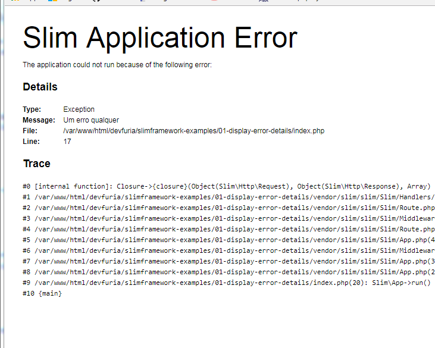

No artigo anterior vimos como instalar o Slim e criamos um Hello World.

Neste artigos vamos aprender como exibir os detalhes no caso de um erro ser lançado pelo PHP.

O Slim permite configurar a aplicação atraves de uma variável qualquer (por convenção utilizaremos `$config`). Passe
sua variável no momento que instancia a classe base do Slim, veja exemplo abaixo.

```php
<?php

// ... havia um código aqui !!!!

$config = [
    'settings' => [
        'displayErrorDetails' => false # change this <------
    ],
];

$app = new \Slim\App($config);
```

Você poderá utilizar essa mesma variável para configurar outras coisas que desejar ou precisar. Mas para exibir os erros
detalhadamente temos que utilizar a propriedade ``settings['displayErrorDetails'] = true`. Veja o código completo logo
abaixo.

```php
<?php

use \Psr\Http\Message\ServerRequestInterface as Request;
use \Psr\Http\Message\ResponseInterface as Response;

require 'vendor/autoload.php';

$config = [
    'settings' => [
        'displayErrorDetails' => true # change this <------
    ],
];

$app = new \Slim\App($config);

$app->get('/', function (Request $req,  Response $res, $args = []) {
    throw new Exception("Um erro qualquer");
});

$app->run();
```

Se for `true`, exibe os detalhes, veja o que é exibido na tela...



Se for `false`, não exibe os erros, os detalhes sãos suprimidos, veja imagem...


